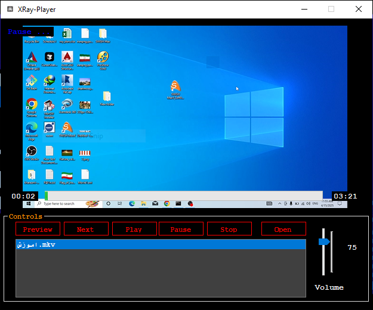
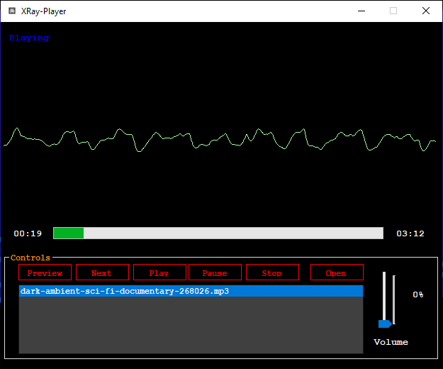

🎵 XRay Media Player

  
  

✨ Features
✔️ Multi-file support – Open and play multiple audio files
✔️ Playlist management – Easily browse and select tracks
✔️ Basic playback controls – Play, pause, stop, and track selection
✔️ Time tracking – Displays current playback position
✔️ Simple & clean UI – Easy-to-use interface

🛠️ Installation & Usage
Clone the repository

sh
git clone https://github.com/Mr-Ali-Jafari/MediaPlayer.git
Open in Visual Studio

Load XRay-MediaPlayer.sln

Build & Run (F5)

How to Use

Click "Open" to load audio files

Select a track from the playlist to play

Use the media controls to manage playback

📂 Project Structure
text
XRay-MediaPlayer/
├── ScreenShots/          # App screenshots
├── XRay-MediaPlayer/     # Source code
│   ├── Form1.cs          # Main player UI & logic
│   ├── Form1.Designer.cs # UI layout
│   └── ...               # Other project files
└── README.md             # Project documentation
🚀 Future Improvements
Add volume control

Support for play/pause buttons

Progress bar for seekable playback

📜 License
This project is licensed under MIT License.

💡 Contributions Welcome!
Feel free to fork, improve, or report issues.

🔗 GitHub: github.com/Mr-Ali-Jafari/MediaPlayer
